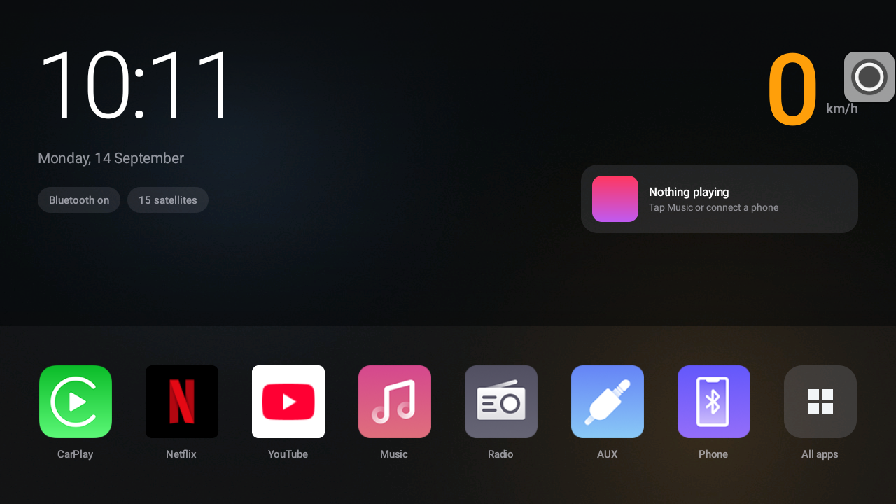
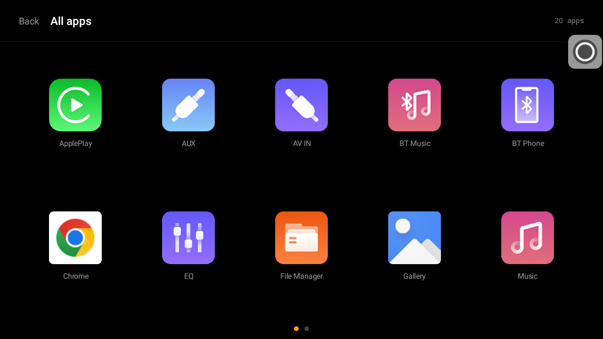
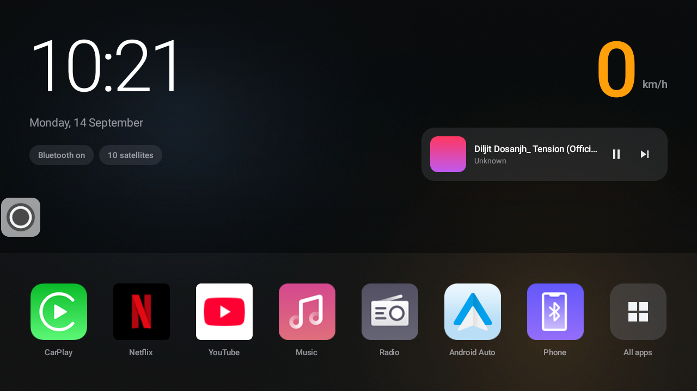
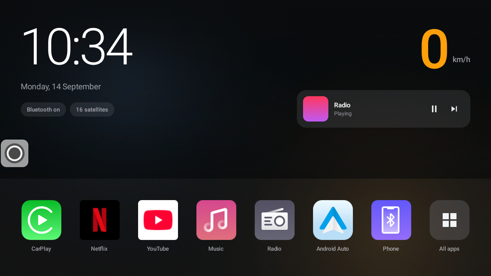

# Dash

A minimal, fast home screen for cheap Android car head units.

Built in one evening for a myTVS unit in a Hyundai Grand i10, because the launcher that ships
on these things is slow and cluttered, and the third-party replacements are heavier than the
hardware can carry.



---

## What it is

A launcher with eight apps, a clock, a GPS speed readout and a now-playing card. That is the
whole product. No widgets, no wallpaper engine, no animations, no analytics, no accounts.

**Zero third-party dependencies.** No AppCompat, no Material Components, no Jetpack Compose,
no image loader. Everything is framework API on `android.app.Activity`. On a device with
1.9 GB of RAM and four Cortex-A35 cores, every dependency is paid for at every boot, for a
screen with eight buttons on it.

| | |
|---|---|
| APK size | **2.3 MB** (debug, unminified) |
| Third-party dependencies | **0** |
| Resident memory | ~77 MB including the wallpaper bitmap and media session |
| Target | Android 11 (API 30), landscape, 1280x720 |
| Language | Kotlin |
| Incremental build | ~8 seconds |

---

## Screens

| Home | All apps |
|---|---|
|  |  |

| Now playing, live from the media session | Radio, which publishes no metadata at all |
|---|---|
|  |  |

The `design/` folder holds the HTML mockups the design was chosen from, including three
rejected directions and the Apple-influenced treatment that became the final look.

---

## Will it work on your head unit?

**Read this before downloading.** Compatibility is not all-or-nothing: the shell works
anywhere, the dock is tuned for one firmware family.

| Feature | Works on | Notes |
|---|---|---|
| Clock, date, app drawer | **Any Android 11+ unit** | Nothing vendor specific. |
| GPS speed | Any unit with a GPS receiver | Uses `Location.getSpeed()`, no CAN bus needed. |
| Now playing | Any app publishing a `MediaSession` | Needs notification access granted once. |
| Wallpaper | Any unit | Reads a file, no storage permission required. |
| **Dock tiles** | **`com.imotor.*` units only** | This is the catch. See below. |

The dock targets specific packages: `com.imotor.phoneconnect` (CarPlay and Android Auto),
`com.imotor.music`, `com.imotor.fmam` (FM radio), `com.imotor.contacts`. That is the "imotor"
firmware family, which myTVS and a number of other rebadged Chinese units are built on.

**On a unit from a different vendor those tiles appear dimmed and do nothing.** They will not
crash: every slot is resolved at runtime and falls back to inert. Netflix, YouTube and All apps
still work, and the drawer still shows everything installed. To fix the rest, edit the `DOCK`
list in [`HomeActivity.kt`](app/src/main/java/com/debashis/carlauncher/HomeActivity.kt) and
rebuild. It is a plain list of package names, deliberately kept as data rather than XML.

Find your own package names with:

```bash
adb shell cmd package query-activities --brief \
  -a android.intent.action.MAIN -c android.intent.category.LAUNCHER
```

Built and tested on: Rockchip **RK3326**, 4x Cortex-A35 @ 1.5 GHz, Mali-G31, 1.9 GB RAM,
Android 11, 1280x720 at density 160.

---

## Install

The APK is debug-signed. That is fine for sideloading, and it means you cannot install it over
a release-signed copy of the same package.

### 1. Get into Developer options

Most of these head units gate Developer options behind a password.

```
Settings -> About -> tap Build number 7 times
```

If it asks for a password, common values on RK-based units are `8888`, `3368`, `1234`, `0000`.
On **RK3326 / Android 11** specifically, the one that usually works is the **current date
followed by three capital letter O**, no dots:

```
20260914OOO
```

It is the letter O, not zero, and it changes every day. Use the date the unit itself displays.
Factory mode is a separate gate with its own password; on many units the default is `8888`.

### 2. Connect over ADB

```bash
# Unit and computer on the same network. A phone hotspot works fine.
# On the unit: Developer options -> Wireless debugging -> ON

adb mdns services          # retry a few times, the list flaps
# -> adb-XXXX  _adb-tls-pairing._tcp  192.168.1.50:37123
# -> adb-XXXX  _adb-tls-connect._tcp  192.168.1.50:44563

adb pair 192.168.1.50:37123 123456     # 6-digit code from "Pair device with pairing code"
adb connect 192.168.1.50:44563
```

The pairing survives reboots. Only the connect port changes, which is why `adb mdns services`
beats memorising a number.

### 3. Install

```bash
adb install -r dash-v1.0.apk
```

### 4. Grant what it needs

```bash
# GPS speed readout
adb shell pm grant com.debashis.carlauncher android.permission.ACCESS_FINE_LOCATION

# Now playing. Android will not hand out media sessions without this.
adb shell cmd notification allow_listener \
  com.debashis.carlauncher/com.debashis.carlauncher.DashNotificationListener
```

Both can also be done on the unit: Settings -> Apps -> Dash -> Permissions, and
Settings -> Notification access.

### 5. Set it as home

Press Home and pick Dash, or Settings -> Apps -> Default apps -> Home app.

> **Choose "Just once" for the first few days, not "Always".**
> If a Home app crashes on startup and it is your default, a car with no physical buttons has
> nothing to fall back to. Keep your old launcher installed and enabled. Once Dash is the
> default, the old launcher unloads itself from memory anyway, so disabling it frees nothing
> and only removes your safety net.

### 6. Wallpaper (optional)

```bash
adb push your-photo.jpg \
  /sdcard/Android/data/com.debashis.carlauncher/files/wallpaper.jpg
```

That path needs no storage permission. Replace the file and return to the home screen; it
re-reads on resume. With no file present you get a dark colour wash.

### Uninstall

```bash
adb uninstall com.debashis.carlauncher
```

Android hands Home back to whatever launcher remains. Dash stores nothing.

---

## Build from source

```bash
export JAVA_HOME=/path/to/jdk17
export ANDROID_HOME=/path/to/android-sdk
./gradlew assembleDebug
```

Output: `app/build/outputs/apk/debug/app-debug.apk`.

JDK 17, Android SDK 34, Gradle 8.7 via the included wrapper. AGP 8.5.2 does not run on
Gradle 9, so use the wrapper rather than a system Gradle.

---

## Design decisions, and why

**Apple-influenced, not Apple.** Vivid squircle icons, translucent material fills instead of
borders, tight negative tracking, true black. SF Pro and SF Symbols are **not** used: they are
licensed for Apple-platform development and cannot ship inside an Android APK.

**The live blur is faked.** Apple's material look depends on real background blur. On an
RK3326, `RenderEffect` behind an always-visible dock is the most expensive thing you could put
on the screen, redrawn every frame. Flat translucency at the same opacity reads the same at
arm's length in a car and costs nothing.

**The app icon is the tile.** No container behind it. These head-unit icons are already
squircles; a container would be a squircle inside a squircle.

**Amber, on the speed only.** Instrument-panel amber preserves night vision far better than
white or blue. There is no tinted "primary" tile: position in the dock is the emphasis.

**The scrim is shaped to the layout, not to the photo.** A photo behind white text is how this
design normally fails: it looks fine with one image, then you change the wallpaper and the
clock becomes unreadable. `drawable/scrim_hero.xml` is heaviest where the clock and speed sit,
lightest across the middle band where nothing is drawn.

**Text sizes in dp, not sp.** A car launcher must not reflow because someone changed the
system font scale.

**Speed comes from GPS,** because a base-trim car has no CAN bus to ask. If no fix arrives for
5 seconds the readout drops to a dash, because a frozen speed reads as real while being wrong.
Anything under 3 km/h is treated as zero, since GPS jitters at a standstill.

**The clock follows the unit's own 12 vs 24 hour setting** rather than hardcoding either.

**Missing packages dim, they never crash.** Every dock slot is resolved at runtime.

**System bars hidden, but recoverable.** `BEHAVIOR_SHOW_TRANSIENT_BARS_BY_SWIPE` means a swipe
from the edge brings the vendor's back and recents buttons back temporarily.

---

## Seven bugs, and what actually caused them

Every one of these compiled cleanly and looked correct in a mockup. None would have been found
without running it on the real panel.

### 1. A short swipe did nothing in the app drawer
Only an edge-to-edge drag changed page; a quick flick sprang back. Two causes compounding. The
fling threshold was 900 px/s, well above the platform minimum, so quick gestures never took the
fling path at all. The fallback then snapped to the *nearest* page, and a short gesture never
moves `scrollX` past 50 percent, so nearest was always the page you started on.

**The trap:** AOSP `HorizontalScrollView` calls `fling(-initialVelocity)`. It **negates** before
handing the value over, so a right-to-left swipe arrives **positive**. The first fix read the
sign backwards, computed page `-1`, and clamped it to `0`. Still nothing.

Found by adding one `Log.d` and reading logcat: `fling v=1333` then `goTo page=-1` said it in a
single line. Guessing twice cost more than instrumenting once.

### 2. The old vendor wallpaper flashed on every launch
`android:windowShowWallpaper="true"` with a transparent `windowBackground` means that in the
moment before your content draws, the **system** wallpaper shows through. Letting the system
composite the wallpaper is cheaper on paper and wrong in practice. Draw your own, and make the
window background opaque so the first frame is already yours.

### 3. "Nothing playing" while music was playing
v1 reflected Bluetooth A2DP connection state, not playback. Local audio is not Bluetooth, so it
could never report anything. Replaced with `MediaSessionManager`, which requires declaring a
`NotificationListenerService` and being granted notification access. The service body is empty:
it exists only as the key Android accepts.

### 4. "Nothing playing" while the FM radio was playing
`com.imotor.fmam` publishes a live session with **`metadata: null`** and `state=3`. The code
required a non-blank title before believing anything was playing, so a source with nothing to
name read as idle. A session now counts as active when it is PLAYING or BUFFERING regardless of
metadata, and the app label is used when there is no title. Skip is shown only when the session
advertises `ACTION_SKIP_TO_NEXT`.

### 5. Speed read 1 km/h while parked
GPS jitters at a standstill. Deadband at 3 km/h.

### 6. The Phone tile was dead
`com.imotor.dialer` exists but has **no launchable activity** on this unit. The phone UI is
`com.imotor.contacts`. The missing-package guard dimmed it correctly rather than crashing,
which is how the bug got noticed instead of causing one.

### 7. CarPlay showed the generic Android robot
`com.imotor.phoneconnect` exposes **four** launcher activities: `.Carplay`, `.AndroidAuto`,
`.AndroidLink`, `.Airplay`. Launching the package default picked the wrong one and the generic
app icon. Targeting the component directly fixed both, and made swapping a tile to Android Auto
a one-line change afterwards.

---

## If your unit feels slow, it is probably not the launcher

Measured on the RK3326, and worth knowing before blaming any software:

```
OMX.rk.video_decoder.avc     H.264 hardware   YES
OMX.rk.video_decoder.hevc    H.265 hardware   YES
OMX.rk.video_decoder.vp8     VP8   hardware   YES
                             VP9   hardware   NO
```

**There is no VP9 hardware decoder, and YouTube streams VP9 by default.** Every YouTube video
above roughly 480p is decoded in software on four 1.5 GHz A35 cores. No launcher, no debloating
and no amount of freed RAM changes that. Capping quality at 480p often drops it back to H.264
and hardware decode.

Freeing memory helps everything else. On the test unit, disabling Google TTS returned 37.7 MB,
and swapping Gboard (88 MB resident) for a minimal keyboard (22 MB) returned another 66 MB.
Note that a 647 KB keyboard APK still costs ~22 MB resident once the Android input framework
loads around it: **APK size is not RAM.**

---

## Roadmap

- **In-app settings** to choose the layout and pick which app sits in each dock slot.
  `HomeActivity.layoutRes()` already exists as the single call site, and `DOCK` is already data
  rather than XML, so this is a settings screen plus layout files, not a rewrite.
- **Icon pack support** (Nova / ADW format): enumerate installed packs via their theme intent,
  parse `appfilter.xml`, substitute icons, fall back to the app's own.
- **Automatic night dimming.** The imotor framework exposes `vehicle_signal_ill_detect`, which
  is the head unit reading the headlight switch. It already drives the unit's own auto-dim, so
  it is usually wired. Read it and darken the scrim; fall back to sunrise and sunset computed
  from the GPS fix.

---

## Licence

MIT. Do what you like with it.

A personal project for one car. Not affiliated with myTVS, Rockchip, Apple, Google, or any
head-unit manufacturer.
